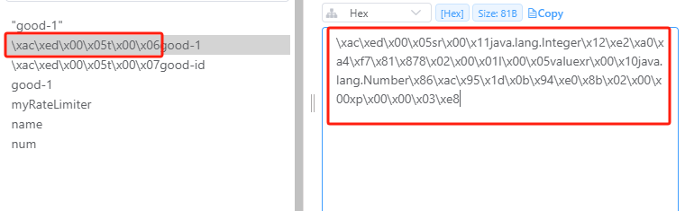

# Spring Data Redis 操作Redis

对于Java来说，操作Redis的工具主要有三种`Jedis`、`Lettuce`、`Redisson`。`Jedis`用法简单，`Lettuce`是Spring官方推出的工具，`Redisson`不仅提供常用的操作，还内置了许多现成的工具，比如`分布式锁`、`限流器`等，功能强大。

为了统一使用，Spring官方提供了`Spring Data Redis` 接口，用来统一操作这三种客户端工具，降低了学习成本。使用时只需要引入`spring-boot-starter-data-redis`依赖即可，默认使用的客户端工具是`Lettuce`，如果需要使用`Jedis`或者`Redisson`，只需要排除`Lettuce`依赖，引入`相对应客户端依赖`即可。

## 使用Jedis

### 引入依赖

```xml
<dependencies>
        <!-- 实现对 Spring Data Redis 的自动化配置 -->
        <dependency>
            <groupId>org.springframework.boot</groupId>
            <artifactId>spring-boot-starter-data-redis</artifactId>
            <exclusions>
                <!-- 去掉对 Lettuce 的依赖，因为 Spring Boot 优先使用 Lettuce 作为 Redis 客户端 -->
                <exclusion>
                    <groupId>io.lettuce</groupId>
                    <artifactId>lettuce-core</artifactId>
                </exclusion>
            </exclusions>
        </dependency>

        <!-- 引入 Jedis 的依赖，这样 Spring Boot 实现对 Jedis 的自动化配置 -->
        <dependency>
            <groupId>redis.clients</groupId>
            <artifactId>jedis</artifactId>
        </dependency>

        <!-- 等会示例会使用 fastjson 作为 JSON 序列化的工具 -->
        <dependency>
            <groupId>com.alibaba</groupId>
            <artifactId>fastjson</artifactId>
            <version>1.2.4</version>
        </dependency>

        <!-- Spring Data Redis 默认使用 Jackson 作为 JSON 序列化的工具 -->
        <dependency>
            <groupId>com.fasterxml.jackson.core</groupId>
            <artifactId>jackson-databind</artifactId>
        </dependency>

    </dependencies>
```

### 配置序列化方式
因为对象需要在网络中进行传输，所以需要序列化和反序列化。`redis`默认的序列化方式是`jdk`序列化，而jdk序列化的格式是`魔数 + 版本号 + 类描述符 + 对象数据 + 引用处理`，所以如果不指定序列化的话，redis存储的key值前面会有一些二进制字节，表示类描述符和其他信息。
错误的例子如下图所示：

为了更方便地查询，所以需要通过`@Cofiguration`注解来自定义`FastJSON`或`Jackson`作为序列化方式。
```java
@Configuration
public class RedisConfig {
    @Bean
    public RedisTemplate<String, Object> redisTemplate(RedisConnectionFactory redisConnectionFactory) {
        RedisTemplate<String, Object> redisTemplate = new RedisTemplate<>();
        redisTemplate.setConnectionFactory(redisConnectionFactory);

        // 使用Jackson2JsonRedisSerialize 替换默认序列化
        Jackson2JsonRedisSerializer jackson2JsonRedisSerializer = new Jackson2JsonRedisSerializer(Object.class);

        // 设置value的序列化规则和 key的序列化规则
        redisTemplate.setHashValueSerializer(jackson2JsonRedisSerializer);
        redisTemplate.setHashKeySerializer(new StringRedisSerializer());

        redisTemplate.setValueSerializer(jackson2JsonRedisSerializer);
        redisTemplate.setKeySerializer(new StringRedisSerializer());
        redisTemplate.afterPropertiesSet();
        return redisTemplate;
    }
}
```
### 使用RedisTemplate操作数据库

```java
@SpringBootTest
public class TestRedis {
    @Autowired
    private StringRedisTemplate  stringRedisTemplate;

    @Autowired
    private RedisTemplate redisTemplate;

    @Test
    public void testSet() {
        stringRedisTemplate.opsForValue().set("name", "jyp");
    }

    @Test
    public void testAdd() {
        redisTemplate.opsForValue().set("count", 1);
        // 如果value是一个数，返回值可以强转为int
        Integer res = (Integer) redisTemplate.opsForValue().get(key);
        // increment或者decrement的返回值是Long，如果value不是数，则会抛出异常
        Long count = redisTemplate.opsForValue().increment(key);
    }
}
```

## 使用Redisson

### 引入依赖

```xml
<dependencies>
    <!-- 实现对 Redisson 的自动化配置 --> <!-- X -->
    <dependency>
        <groupId>org.redisson</groupId>
        <artifactId>redisson-spring-boot-starter</artifactId>
        <version>3.11.3</version>
    </dependency>

    <!-- 等会示例会使用 fastjson 作为 JSON 序列化的工具 -->
    <dependency>
        <groupId>com.alibaba</groupId>
        <artifactId>fastjson</artifactId>
        <version>1.2.4</version>
    </dependency>

    <!-- Spring Data Redis 默认使用 Jackson 作为 JSON 序列化的工具 -->
    <dependency>
        <groupId>com.fasterxml.jackson.core</groupId>
        <artifactId>jackson-databind</artifactId>
    </dependency>

    <dependency>
        <groupId>commons-io</groupId>
        <artifactId>commons-io</artifactId>
        <version>2.6</version>
    </dependency>

</dependencies>
```

### 使用redisson的分布式锁和限流器功能

```java
@SpringBootTest
public class TestRedisson {
    private static final String LOCK_KEY = "anylock";

    @Autowired // <1>
    private RedissonClient redissonClient;

    /**
     *  redisson分布式锁
     */
    @Test
    public void testLock() throws InterruptedException {
        // <2.1> 启动一个线程 A ，去占有锁
        new Thread(() -> {
            // 加锁以后 10 秒钟自动解锁
            // 无需调用 unlock 方法手动解锁
            final RLock lock = redissonClient.getLock(LOCK_KEY);
            lock.lock(10, TimeUnit.SECONDS);
        }).start();
        // <2.2> 简单 sleep 1 秒，保证线程 A 成功持有锁
        Thread.sleep(1000L);

        // <3> 尝试加锁，最多等待 100 秒，上锁以后 10 秒自动解锁
        System.out.printf("准备开始获得锁时间：%s%n", new SimpleDateFormat("yyyy-MM-dd HH:mm:ss").format(new Date()));
        final RLock lock = redissonClient.getLock(LOCK_KEY);
        boolean res = lock.tryLock(100, 10, TimeUnit.SECONDS);
        if (res) {
            System.out.printf("实际获得锁时间：%s%n", new SimpleDateFormat("yyyy-MM-dd HH:mm:ss").format(new Date()));
        } else {
            System.out.println("加锁失败");
        }
    }


    /**
     * 限流器
     * @throws Exception
     */
    @Test
    public void testRateLimiter() throws Exception{
        // 创建 RRateLimiter 对象
        RRateLimiter rateLimiter = redissonClient.getRateLimiter("myRateLimiter");
        // 初始化：最大流速 = 每 1 秒钟产生 2 个令牌
        rateLimiter.trySetRate(RateType.OVERALL, 2, 1, RateIntervalUnit.SECONDS);
//        rateLimiter.trySetRate(RateType.PER_CLIENT, 50, 1, RateIntervalUnit.MINUTES);

        SimpleDateFormat simpleDateFormat = new SimpleDateFormat("yyyy-MM-dd HH:mm:ss");
        // 因为进行了限流，所以后面的循环不会获取到令牌
        for (int i = 0; i < 5; i++) {
            System.out.printf("%s：获得锁结果(%s)%n", simpleDateFormat.format(new Date()),
                    rateLimiter.tryAcquire());
            Thread.sleep(250L);
        }
    }
}
```